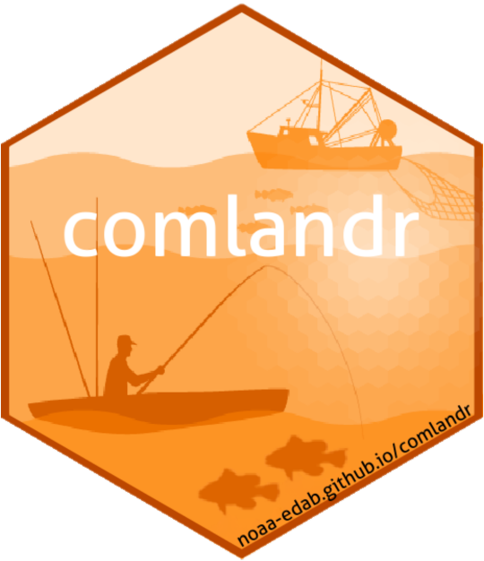

# comlandr  

`comlandr` allows users to pull and process commercial fishing data from the Northeast USA. Northwest Atlantic Fisheries Organization ([NAFO](https://www.nafo.int/)) data is included to capture landings by non US fleets in US waters.

To use this package you will need:

1. To be behind the NEFSC firewall
2. Permissions to access the required server/databases: a username and password.
3. Permissions to access [schema/tables](https://noaa-edab.github.io/comlandr/articles/schemas.html)
4. Oracle's instant Client installed
5. Oracle's R package `ROracle` installed

"This product uses the [FRED® API](https://fred.stlouisfed.org/) but is not endorsed or certified by the Federal Reserve Bank of St. Louis."

## Usage

### Installation

`pak::pak("NOAA-EDAB/comlandr")`

### Getting started

Please see the [getting started guide](https://noaa-edab.github.io/comlandr/articles/comlandr.html)

## Developers (in alphabetical order)

| [andybeet](https://github.com/andybeet)                                                         | [slucey](https://github.com/slucey)                                                                                                    |
|-------------------------------------------------------------------------------------------------|----------------------------------------------------------------------------------------------------------------------------------------|
|  |  |

#### Legal disclaimer

*This repository is a scientific product and is not official
communication of the National Oceanic and Atmospheric Administration, or
the United States Department of Commerce. All NOAA GitHub project code
is provided on an 'as is' basis and the user assumes responsibility for
its use. Any claims against the Department of Commerce or Department of
Commerce bureaus stemming from the use of this GitHub project will be
governed by all applicable Federal law. Any reference to specific
commercial products, processes, or services by service mark, trademark,
manufacturer, or otherwise, does not constitute or imply their
endorsement, recommendation or favoring by the Department of Commerce.
The Department of Commerce seal and logo, or the seal and logo of a DOC
bureau, shall not be used in any manner to imply endorsement of any
commercial product or activity by DOC or the United States Government.*
